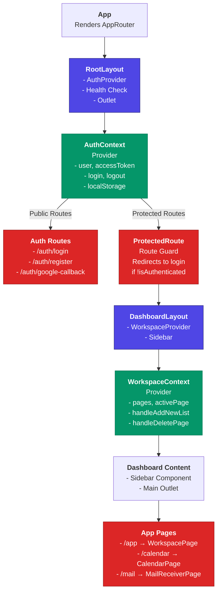
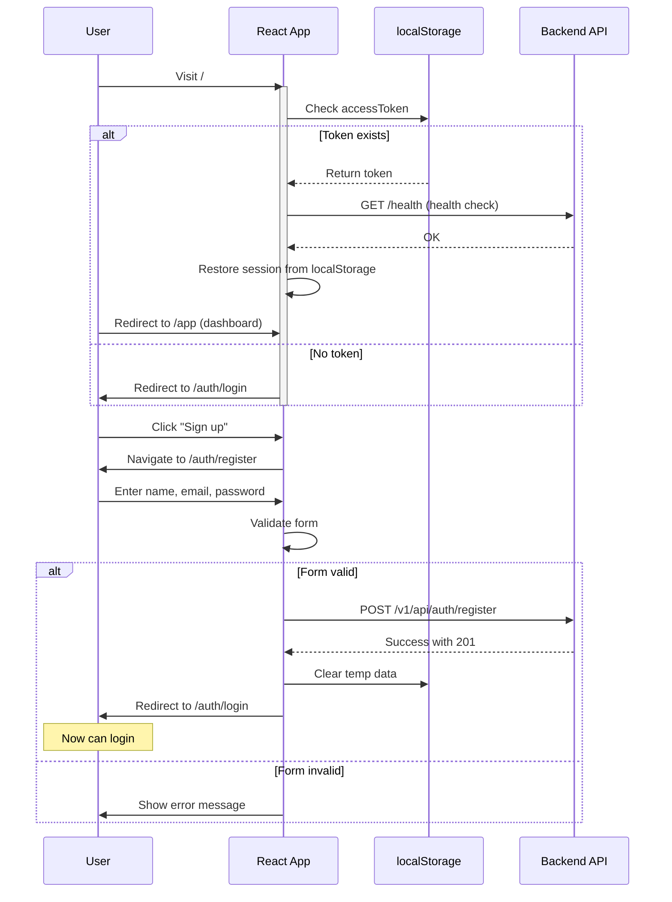
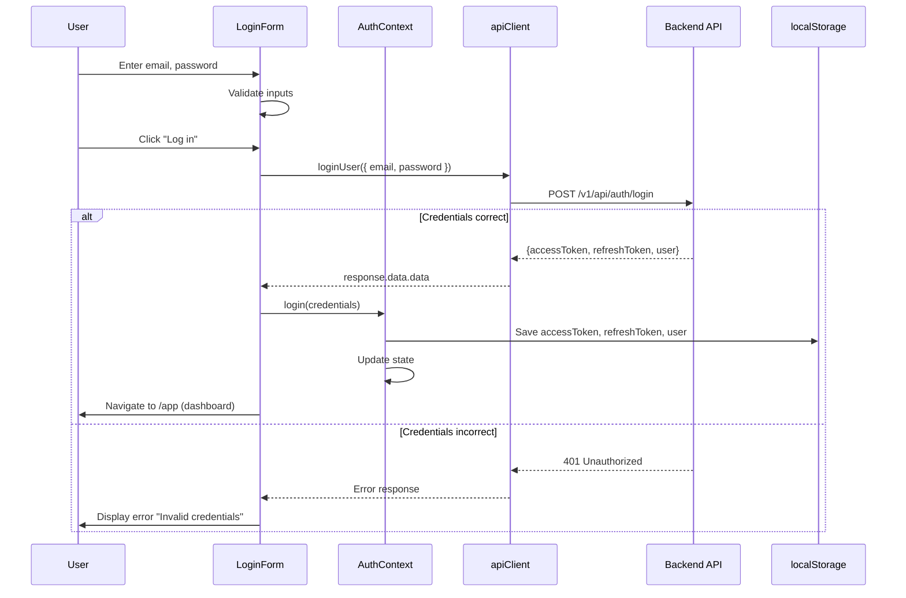
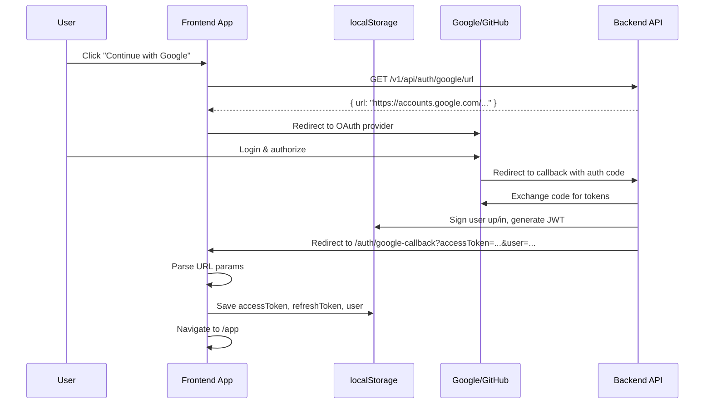
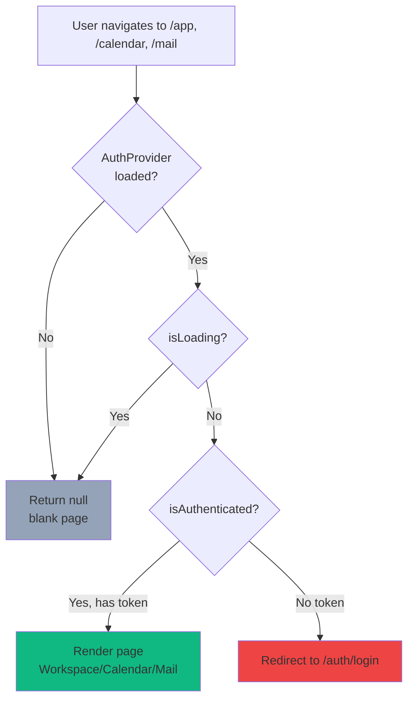
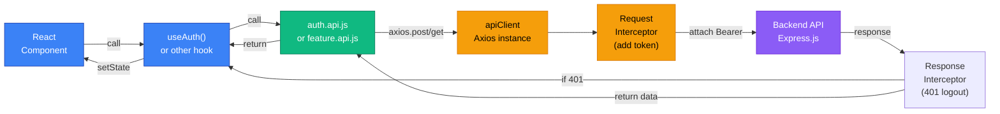

# 📱 Frontend Architecture Documentation

> **Project**: PBL3 - Workspace & Task Management Application  
> **Tech Stack**: React 19 + Vite + React Router 7 + Tailwind CSS + Axios  
> **Last Updated**: March 13, 2026

---

## 📑 Table of Contents

1. [Project Overview](#1-project-overview)
2. [Architecture Diagram](#2-architecture-diagram)
3. [Directory Structure](#3-directory-structure)
4. [Application Flow](#4-application-flow)
5. [Authentication Flow](#5-authentication-flow)
6. [API & Data Flow](#6-api--data-flow)
7. [Features & Modules](#7-features--modules)
8. [Components Reference](#8-components-reference)
9. [Custom Hooks Reference](#9-custom-hooks-reference)
10. [API Endpoints Reference](#10-api-endpoints-reference)
11. [State Management Guide](#11-state-management-guide)
12. [Development Guide](#12-development-guide)

---

## 1. Project Overview

### 1.1 Purpose

A modern workspace management application inspired by Notion, enabling users to:

- ✅ Create and manage todo lists/tasks
- 📅 Integrate Google Calendar
- 📧 Receive and manage notifications from external services (Gmail, GitHub)
- 👥 Collaborate with teams (future)
- 🔐 Secure authentication via email/password or OAuth (Google, GitHub)

### 1.2 Tech Stack

| Layer                | Technology           | Purpose                                      |
| -------------------- | -------------------- | -------------------------------------------- |
| **Build**            | Vite 7.2.4           | Fast development server & production bundler |
| **UI Framework**     | React 19.2.0         | Component-based UI                           |
| **Routing**          | React Router 7.12.0  | Client-side routing & navigation             |
| **Styling**          | Tailwind CSS 4.1.18  | Utility-first CSS framework                  |
| **HTTP Client**      | Axios 1.13.6         | Promise-based API requests                   |
| **Icons**            | Lucide React 0.563.0 | Lightweight icon library                     |
| **State Management** | React Context API    | Global state (Auth, Workspace)               |
| **Storage**          | localStorage         | Persist tokens & user data                   |
| **Linting**          | ESLint 9.39.1        | Code quality & consistency                   |

### 1.3 Key Features

| Feature                     | Status    | File Location                                  |
| --------------------------- | --------- | ---------------------------------------------- |
| Email/Password Auth         | ✅ Active | `features/auth/`                               |
| OAuth (Google, GitHub)      | ✅ Active | `features/auth/`                               |
| Protected Routes            | ✅ Active | `features/auth/components/protected-route.jsx` |
| Workspace/Sidebar           | ✅ Active | `features/workspace/`                          |
| Task Management (Todo List) | ✅ Active | `features/workspace/components/TaskList.jsx`   |
| Google Calendar Integration | ✅ Active | `features/GoogleCalendar/`                     |
| Notification Receiver       | ✅ Active | `features/NotificationReceiver/`               |

---

## 2. Architecture Diagram

### 2.1 Component Hierarchy



### 2.2 Data Flow Architecture

```mermaid
graph LR
    UI["<b>User Input</b><br/>Form, Click, Navigate"]
    Component["<b>Component</b><br/>State Management<br/>Event Handlers"]
    Context["<b>Context API</b><br/>AuthContext<br/>WorkspaceContext"]
    API["<b>API Layer</b><br/>apiClient.js<br/>feature.api.js"]
    Backend["<b>Backend API</b><br/>Express.js<br/>Prisma DB"]
    Storage["<b>localStorage</b><br/>accessToken<br/>refreshToken<br/>user"]

    UI -->|setState| Component
    Component -->|consume| Context
    Component -->|call api()| API
    API -->|axios.post/get| Backend
    Backend -->|response| API
    API -->|dispatch/update| Context
    Component -->|read state| Storage
    Component -->|write tokens| Storage

    classDef userLevel fill:#f59e0b,stroke:#d97706,color:#000
    classDef clientLevel fill:#3b82f6,stroke:#1e40af,color:#fff
    classDef globalLevel fill:#10b981,stroke:#047857,color:#fff
    classDef externalLevel fill:#8b5cf6,stroke:#6d28d9,color:#fff

    class UI userLevel
    class Component,Context clientLevel
    class Storage globalLevel
    class API,Backend externalLevel
```

---

## 3. Directory Structure

```
frontend/
├── README.md
├── package.json                    # Dependencies, scripts
├── vite.config.js                  # Build configuration
├── eslint.config.js                # Linting rules
├── index.html                      # Entry HTML
├── public/                         # Static assets
│
├── src/
│   ├── main.jsx                    # React DOM render entry
│   ├── index.css                   # Global styles
│   ├── App.jsx                     # Root component
│   ├── router.jsx                  # Route configuration
│   │
│   ├── layouts/
│   │   ├── RootLayout.jsx          # Outermost wrapper (AuthProvider, health check)
│   │   ├── DashboardLayout.jsx     # Dashboard wrapper (Sidebar, WorkspaceProvider)
│   │   └── AuthLayout.jsx          # Auth pages wrapper (login, register)
│   │
│   ├── utils/
│   │   └── apiClient.js            # Axios HTTP client with interceptors
│   │
│   ├── hooks/
│   │   └── useAuth.js              # Custom hook to consume AuthContext
│   │
│   ├── components/
│   │   ├── shared/                 # Reusable components
│   │   │   ├── index.js
│   │   │   ├── UserAvatar.jsx      # Display user initial avatar
│   │   │   ├── NavItem.jsx         # Navigation button component
│   │   │   ├── PageItem.jsx        # Page/list item in sidebar
│   │   │   └── SectionHeader.jsx   # Section title + add button
│   │   │
│   │   └── ui/
│   │       └── SocialButtons.jsx   # Google & GitHub login buttons
│   │
│   ├── config/
│   │   └── database.js             # (Backend reference only)
│   │
│   │
│   └── features/                   # Feature modules (organized by functionality)
│       │
│       ├── auth/                   # Authentication feature
│       │   ├── index.js            # Barrel export
│       │   ├── api/
│       │   │   └── auth.api.js     # API calls: register, login, oauth URLs
│       │   ├── context/
│       │   │   └── AuthContext.jsx # Global auth state (user, tokens, login/logout)
│       │   ├── components/
│       │   │   ├── LoginForm.jsx   # Login form component
│       │   │   ├── RegisterForm.jsx # Register form component
│       │   │   └── protected-route.jsx # Route guard for authenticated routes
│       │   ├── pages/
│       │   │   ├── login-page.jsx
│       │   │   ├── register-page.jsx
│       │   │   └── google-callback-page.jsx # OAuth callback handler
│       │   └── dto/                # (Future: form validation DTOs)
│       │
│       ├── workspace/              # Workspace/sidebar + task management
│       │   ├── index.js
│       │   ├── api/                # (Future: workspace API calls)
│       │   ├── context/
│       │   │   └── WorkspaceContext.jsx # State: pages, activePage
│       │   ├── components/
│       │   │   ├── Sidebar.jsx     # Main sidebar layout
│       │   │   ├── Sidebar.css     # Sidebar styling
│       │   │   ├── TopBar.jsx      # Page title + actions
│       │   │   ├── TopBar.css
│       │   │   ├── TaskList.jsx    # Todo list view + CRUD
│       │   │   └── TaskList.css
│       │   ├── pages/
│       │   │   └── workspace-page.jsx # Route component
│       │   ├── panels/             # Sidebar sub-components
│       │   │   ├── index.js
│       │   │   ├── inbox/
│       │   │   │   ├── InboxPanel.jsx
│       │   │   │   └── inbox.constants.js
│       │   │   ├── user-menu/
│       │   │   │   ├── UserMenu.jsx
│       │   │   │   └── useUserMenu.js
│       │   │   └── invite/
│       │   │       └── InvitePanel.jsx
│       │   ├── constants/
│       │   │   ├── index.js
│       │   │   └── navigation.js   # MAIN_NAV_ITEMS, NOTION_APPS, BOTTOM_NAV_ITEMS
│       │   ├── dto/
│       │   │   └── (Future: workspace DTOs)
│       │   └── repository/
│       │       └── (Future: workspace API calls)
│       │
│       ├── GoogleCalendar/         # Calendar integration feature
│       │   ├── index.js
│       │   ├── pages/
│       │   │   └── calendar-page.jsx # Calendar view + event management
│       │   ├── components/
│       │   │   ├── CalendarHeader.jsx # Month navigation + add event button
│       │   │   ├── CalendarGrid.jsx   # Month view grid
│       │   │   ├── CalendarSidebar.jsx # Mini calendar + event list
│       │   │   ├── CalendarDayCell.jsx # Individual day cell
│       │   │   ├── CalendarEvent.jsx   # Event badge in calendar
│       │   │   └── EventModal.jsx     # Create/edit event modal
│       │   ├── api/                # (Future: calendar API calls)
│       │   └── context/            # (Future: calendar context)
│       │
│       ├── NotificationReceiver/   # Email/mail notifications feature
│       │   ├── index.js
│       │   ├── pages/
│       │   │   ├── mail-receiver-page.jsx # Mail inbox view
│       │   │   └── MailReceiver.css
│       │   ├── api/                # (Future: mail API calls)
│       │   └── context/            # (Future: notification context)
│       │
│       ├── email/                  # Email feature (future)
│       │   └── (placeholder for email service)
│       │
│       └── github/                 # GitHub integration (future)
│           └── (placeholder for GitHub service)
│
└── generated/
    └── prisma/                     # Auto-generated Prisma client (schema reference)
        ├── browser.ts
        ├── client.ts
        ├── commonInputTypes.ts
        ├── enums.ts
        ├── models.ts
        ├── internal/
        └── models/
```

---

## 4. Application Flow

### 4.1 User Journey - First Time Visitor



### 4.2 User Journey - Login



### 4.3 OAuth (Google/GitHub) Flow



### 4.4 Protected Routes Flow



---

## 5. Authentication Flow

### 5.1 Auth System Architecture

```
┌─────────────────────────────────────────────────────────┐
│              AUTHENTICATION SYSTEM                       │
├─────────────────────────────────────────────────────────┤
│                                                          │
│  ┌──────────────────────────────────────────────────┐  │
│  │         AuthContext (Global State)               │  │
│  ├──────────────────────────────────────────────────┤  │
│  │ - user: {id, email, fullName}                   │  │
│  │ - accessToken: JWT string                       │  │
│  │ - refreshToken: refresh JWT                     │  │
│  │ - isAuthenticated: boolean                      │  │
│  │ - isLoading: boolean                            │  │
│  │                                                  │  │
│  │ Methods:                                         │  │
│  │ - login(credentials) → API call                 │  │
│  │ - loginWithOAuth(data) → Direct update          │  │
│  │ - register(formData) → API call                 │  │
│  │ - logout() → Clear state & storage              │  │
│  └──────────────────────────────────────────────────┘  │
│                                                          │
│  ┌──────────────────────────────────────────────────┐  │
│  │         API Layer (auth.api.js)                  │  │
│  ├──────────────────────────────────────────────────┤  │
│  │ - registerUser(data) → POST /register            │  │
│  │ - loginUser(data) → POST /login                  │  │
│  │ - getGoogleAuthUrl() → GET /google/url           │  │
│  │ - getGithubAuthUrl() → GET /github/url           │  │
│  │ - healthCheck() → GET /health                    │  │
│  └──────────────────────────────────────────────────┘  │
│                                                          │
│  ┌──────────────────────────────────────────────────┐  │
│  │     HTTP Client (apiClient.js - Axios)           │  │
│  ├──────────────────────────────────────────────────┤  │
│  │ - Request Interceptor: Attach Bearer token      │  │
│  │ - Response Interceptor: Handle 401 → logout     │  │
│  │ - Base URL: http://localhost:3000 (dev)         │  │
│  └──────────────────────────────────────────────────┘  │
│                                                          │
│  ┌──────────────────────────────────────────────────┐  │
│  │         Local Storage (Persistence)              │  │
│  ├──────────────────────────────────────────────────┤  │
│  │ - accessToken (JWT)                             │  │
│  │ - refreshToken (JWT)                            │  │
│  │ - user (JSON stringified)                       │  │
│  └──────────────────────────────────────────────────┘  │
│                                                          │
└─────────────────────────────────────────────────────────┘
```

### 5.2 Login Flow (Email/Password)

```
1. User enters email & password in LoginForm
   ↓
2. Form validates inputs
   ↓
3. Form calls useAuth().login(credentials)
   ↓
4. AuthContext.login() calls auth.api.loginUser()
   ↓
5. apiClient.post("/v1/api/auth/login", { email, password })
   ↓
6. Backend validates, returns { accessToken, refreshToken, user }
   ↓
7. AuthContext calls persistAuth() → save to localStorage + update state
   ↓
8. useNavigate() redirects to /app
   ↓
9. DashboardLayout renders (WorkspaceProvider + Sidebar + Pages)
```

### 5.3 Session Restoration

```
App Load (RootLayout)
   ↓
AuthProvider.useEffect() on mount
   ↓
Check localStorage for accessToken & user
   ↓
If found → restore state (setAccessToken, setUser)
   ↓
If not found → start as unauthenticated
   ↓
setIsLoading(false) → UI renders
   ↓
Health check API call (doesn't block rendering)
```

### 5.4 Logout Flow

```
User clicks "Log out" in UserMenu
   ↓
UserMenu calls useAuth().logout()
   ↓
AuthContext.logout() clears:
   - localStorage (remove all auth keys)
   - Context state (setAccessToken(null), setUser(null))
   ↓
useNavigate() redirects to /auth/login
   ↓
User sees login form
```

---

## 6. API & Data Flow

### 6.1 Request Flow Diagram



### 6.2 API Request Cycle

```
┌────────────────────────────────────────────────────────┐
│              API REQUEST LIFECYCLE                      │
└────────────────────────────────────────────────────────┘

1️⃣  COMPONENT/HOOK CALLS API
    └─> Example: useAuth().login({ email, password })

2️⃣  API FUNCTION MAKES REQUEST
    └─> apiClient.post('/v1/api/auth/login', credentials)

3️⃣  REQUEST INTERCEPTOR EXECUTES
    └─> Attach Authorization header: Bearer {accessToken}
    └─> Pass to backend

4️⃣  BACKEND PROCESSES REQUEST
    └─> Validate token (if protected endpoint)
    └─> Process business logic
    └─> Return response or error

5️⃣  RESPONSE INTERCEPTOR EXECUTES
    ├─> If status === 401
    │   └─> Clear localStorage
    │   └─> Navigate to /auth/login
    │   └─> Return rejected Promise
    │
    └─> Else
        └─> Return response data as-is

6️⃣  PROMISE RESOLVES/REJECTS
    └─> Component handles result
    └─> Update state, show UI, navigate, etc.
```

### 6.3 Data Model Flow

```
┌─────────────────────────────────┐
│  User Registration/Login        │
├─────────────────────────────────┤
│                                 │
│  User {                         │
│    id: UUID                     │
│    email: string                │
│    fullName: string             │
│    passwordHash: string (server)│
│  }                              │
│                                 │
│  Tokens {                       │
│    accessToken: JWT             │
│    refreshToken: JWT            │
│  }                              │
│                                 │
│  Storage (localStorage) {       │
│    accessToken                  │
│    refreshToken                 │
│    user: JSON                   │
│  }                              │
└─────────────────────────────────┘

┌─────────────────────────────────┐
│  Workspace/Pages/Tasks          │
├─────────────────────────────────┤
│                                 │
│  Page {                         │
│    id: string                   │
│    label: string                │
│    icon: React Component        │
│    type: 'private'|'shared'     │
│    indent?: boolean             │
│    active?: boolean             │
│  }                              │
│                                 │
│  Task {                         │
│    id: number (timestamp)       │
│    text: string                 │
│    done: boolean                │
│    date: YYYY-MM-DD             │
│  }                              │
│                                 │
│  Context State {                │
│    pages: Page[]                │
│    activePage: string           │
│  }                              │
└─────────────────────────────────┘

┌─────────────────────────────────┐
│  Calendar Events                │
├─────────────────────────────────┤
│                                 │
│  Event {                        │
│    id: number                   │
│    title: string                │
│    date: YYYY-MM-DD             │
│    time?: HH:MM                 │
│    color: hex color             │
│  }                              │
│                                 │
│  Component State {              │
│    events: Event[]              │
│    currentDate: Date            │
│    selectedDate?: Date          │
│  }                              │
└─────────────────────────────────┘
```

---

## 7. Features & Modules

### 7.1 Authentication Module (`features/auth/`)

**Purpose**: User registration, login, OAuth integration, protected routes

**Key Files**:

- [auth.api.js](src/features/auth/api/auth.api.js) - API calls: registerUser, loginUser, getGoogleAuthUrl, getGithubAuthUrl
- [AuthContext.jsx](src/features/auth/context/AuthContext.jsx) - Global auth state & methods
- [LoginForm.jsx](src/features/auth/components/LoginForm.jsx) - Login form UI
- [RegisterForm.jsx](src/features/auth/components/RegisterForm.jsx) - Register form UI
- [protected-route.jsx](src/features/auth/components/protected-route.jsx) - Route guard
- [google-callback-page.jsx](src/features/auth/pages/google-callback-page.jsx) - OAuth callback handler

**Flow**:

```
User → LoginForm → useAuth().login() → API call → localStorage
                                   → navigate to /app

Protected Routes → ProtectedRoute → check isAuthenticated
                                 → render page or redirect to login
```

**API Endpoints Used**:

- `POST /v1/api/auth/register` - Create account
- `POST /v1/api/auth/login` - Login with credentials
- `GET /v1/api/auth/google/url` - Get Google OAuth redirect URL
- `GET /v1/api/auth/github/url` - Get GitHub OAuth redirect URL

---

### 7.2 Workspace Module (`features/workspace/`)

**Purpose**: Main application workspace - sidebar, page management, task lists

**Key Files**:

- [WorkspaceContext.jsx](src/features/workspace/context/WorkspaceContext.jsx) - Pages state (activePage, pages array)
- [Sidebar.jsx](src/features/workspace/components/Sidebar.jsx) - Left sidebar with navigation & pages
- [TopBar.jsx](src/features/workspace/components/TopBar.jsx) - Page title & action buttons
- [TaskList.jsx](src/features/workspace/components/TaskList.jsx) - Todo list with CRUD operations
- [workspace-page.jsx](src/features/workspace/pages/workspace-page.jsx) - Route component

**Sub-Components**:

- **InboxPanel** - Notifications inbox (mock data)
- **UserMenu** - User profile dropdown with logout
- **InvitePanel** - Invite team members (placeholder)

**Features**:

- ✅ View multiple pages/lists
- ✅ Switch active page
- ✅ Add new list
- ✅ Rename page
- ✅ Delete page
- ✅ Create/edit/delete tasks
- ✅ Mark tasks as complete
- ✅ Filter tasks (Todo/Done)
- ✅ Search tasks
- ✅ Sort & filter options (UI ready)

**State Management**:

```
WorkspaceContext {
  pages: [
    { id, icon, label, type, indent, active }
  ],
  activePage: 'todo',
  setActivePage(id),
  handleAddNewList(),
  handleDeletePage(id),
  handleRenamePage(id, newLabel)
}
```

**Data Flow**:

```
DashboardLayout provides WorkspaceProvider
  → Sidebar reads pages + calls handler functions
  → WorkspacePage reads activePage + renders TaskList
  → TaskList manages local task state
```

---

### 7.3 Google Calendar Feature (`features/GoogleCalendar/`)

**Purpose**: Integrated calendar view with event management

**Key Files**:

- [calendar-page.jsx](src/features/GoogleCalendar/pages/calendar-page.jsx) - Main calendar view
- [CalendarHeader.jsx](src/features/GoogleCalendar/components/CalendarHeader.jsx) - Navigation & add event
- [CalendarGrid.jsx](src/features/GoogleCalendar/components/CalendarGrid.jsx) - Month view grid
- [CalendarSidebar.jsx](src/features/GoogleCalendar/components/CalendarSidebar.jsx) - Mini calendar + event list
- [CalendarDayCell.jsx](src/features/GoogleCalendar/components/CalendarDayCell.jsx) - Individual day cell
- [CalendarEvent.jsx](src/features/GoogleCalendar/components/CalendarEvent.jsx) - Event badge
- [EventModal.jsx](src/features/GoogleCalendar/components/EventModal.jsx) - Create/edit event modal

**Features**:

- 📅 Month view calendar
- 🎯 Navigate to previous/next month
- 📍 Today button
- ➕ Create new event
- ✏️ Edit existing event
- 🗑️ Delete event
- 🎨 Color-coded events
- 📍 Event time display
- 🔍 Mini calendar for quick date selection

**State Management** (local component state):

```
CalendarPage {
  currentDate: Date,
  selectedDate?: Date,
  events: Event[],
  showModal: boolean,
  editingEvent?: Event
}
```

**Data Model**:

```
Event {
  id: number,
  title: string,
  date: 'YYYY-MM-DD',
  time?: 'HH:MM',
  color: '#hex'
}
```

---

### 7.4 Notification Receiver Feature (`features/NotificationReceiver/`)

**Purpose**: Display notifications/emails from external services

**Key Files**:

- [mail-receiver-page.jsx](src/features/NotificationReceiver/pages/mail-receiver-page.jsx) - Mail inbox view
- [MailReceiver.css](src/features/NotificationReceiver/pages/MailReceiver.css)

**Sections**:

1. **Recently Received** - Cards showing latest emails
   - Source: Google (Chrome), GitHub, etc.
   - Display: Sender, Subject, Time, Icon
2. **Suggested for You** - Learning resources
   - Connect account tutorial
   - Create automation rules
   - Customize inbox

**Data Model**:

```
Notification {
  id: number,
  source: 'google' | 'github' | 'mail',
  sender: string,
  subject: string,
  preview?: string,
  time: string,
  unread: boolean,
  icon: React.ReactNode,
  color: '#hex'
}

SuggestedItem {
  id: number,
  title: string,
  type: 'watch' | 'read',
  meta: string,
  image: emoji
}
```

**Status**: 🔮 Mock data only - Backend integration needed

---

## 8. Components Reference

### 8.1 Layout Components

#### RootLayout

**File**: [src/layouts/RootLayout.jsx](src/layouts/RootLayout.jsx)

**Purpose**: Outermost wrapper for entire application

**Responsibilities**:

- Wrap AuthProvider (provides auth context to all child routes)
- Perform health check on mount
- Render Outlet for child routes

**Props**: None (receives children via Outlet)

**State**: None (stateless)

**Key Methods**:

- `useEffect()` - Health check on mount: `GET /health`

```jsx
useEffect(() => {
  healthCheck()
    .then((res) => console.log("[Health Check] Backend OK ✓", res.data))
    .catch((err) =>
      console.error("[Health Check] Backend unreachable ✗", err.message),
    );
}, []);
```

---

#### DashboardLayout

**File**: [src/layouts/DashboardLayout.jsx](src/layouts/DashboardLayout.jsx)

**Purpose**: Layout for authenticated dashboard area

**Responsibilities**:

- Provide WorkspaceContext to child routes
- Render Sidebar
- Render DashboardContent with Outlet for pages

**Props**: None

**Structure**:

```jsx
DashboardLayout
├── WorkspaceProvider
│   └── DashboardContent
│       ├── Sidebar (consumes WorkspaceContext)
│       └── main
│           └── Outlet (WorkspacePage, CalendarPage, MailReceiverPage)
```

---

#### AuthLayout

**File**: [src/layouts/AuthLayout.jsx](src/layouts/AuthLayout.jsx)

**Purpose**: Centered card layout for auth pages

**Props**:

- `children` (React.ReactNode) - Form components

**Features**:

- Centered card design
- Full screen height
- Fade-in animation
- Used by: LoginPage, RegisterPage

---

### 8.2 Shared Components

#### UserAvatar

**File**: [src/components/shared/UserAvatar.jsx](src/components/shared/UserAvatar.jsx)

**Purpose**: Display user initial in circular avatar

```jsx
<UserAvatar initial="J" /> // Shows "J" in circle
```

---

#### NavItem

**File**: [src/components/shared/NavItem.jsx](src/components/shared/NavItem.jsx)

**Purpose**: Navigation menu item with icon

**Props**:

- `icon` (React Component) - Icon from lucide-react
- `label` (string) - Display text
- `onClick` (function) - Handler
- `isActive` (boolean) - Default: false

```jsx
<NavItem
  icon={Home}
  label="Home"
  isActive={true}
  onClick={() => navigate("/app")}
/>
```

---

#### PageItem

**File**: [src/components/shared/PageItem.jsx](src/components/shared/PageItem.jsx)

**Purpose**: Page/list item in sidebar with rename/delete actions

**Props**:

- `page` (object) - `{ id, icon, label, type, indent }`
- `isActive` (boolean)
- `onClick` (function)
- `onDelete` (function)
- `onRename` (function)

**Features**:

- Double-click OR click pencil icon to rename
- Click trash icon to delete
- Visual feedback for active state

---

#### SectionHeader

**File**: [src/components/shared/SectionHeader.jsx](src/components/shared/SectionHeader.jsx)

**Purpose**: Section title with optional add button

**Props**:

- `title` (string) - Section name
- `onAdd` (function) - Optional add button handler

---

### 8.3 Feature-Specific Components

#### LoginForm / RegisterForm

**Files**:

- [LoginForm.jsx](src/features/auth/components/LoginForm.jsx)
- [RegisterForm.jsx](src/features/auth/components/RegisterForm.jsx)

**Purpose**: User input forms for authentication

**Features**:

- Email/password validation
- Password visibility toggle
- Social login buttons (Google, GitHub)
- Error message display
- Loading state during submission
- Form submission handling

---

#### Sidebar

**File**: [src/features/workspace/components/Sidebar.jsx](src/features/workspace/components/Sidebar.jsx)

**Purpose**: Main left sidebar navigation

**Sections**:

1. User Menu (profile + dropdown)
2. Main Navigation (search, home, meetings, AI, inbox)
3. Private Pages (user's pages list)
4. Shared (start collaborating)
5. Notion Apps (mail, calendar)
6. Bottom Nav (settings, marketplace, trash)

**Props**: (from DashboardLayout)

- `pages` (array)
- `activePage` (string)
- `onPageClick`, `onAddNewList`, `onDeletePage`, `onRenamePage` (functions)

---

#### TaskList

**File**: [src/features/workspace/components/TaskList.jsx](src/features/workspace/components/TaskList.jsx)

**Purpose**: Todo list with full CRUD operation

**Features**:

- ✅ Add new task
- ✅ Mark task complete/incomplete
- ✅ Edit task text
- ✅ Delete task
- ✅ Tab filter (Todo / Done)
- ✅ Search tasks
- ✅ Sort & filter buttons (UI only)

**State**:

```jsx
const [tasks, setTasks] = useState(INITIAL_TASKS);
const [activeTab, setActiveTab] = useState("todo");
const [editingId, setEditingId] = useState(null);
const [searchQuery, setSearchQuery] = useState("");
```

---

#### CalendarPage & Components

**Key Components**:

- **CalendarHeader** - Month navigation, today button, add event
- **CalendarGrid** - 6-week month view with day cells
- **CalendarSidebar** - Mini calendar + event list
- **CalendarDayCell** - Individual day with events
- **CalendarEvent** - Event badge
- **EventModal** - Create/edit event form

---

#### SocialButtons

**File**: [src/components/ui/SocialButtons.jsx](src/components/ui/SocialButtons.jsx)

**Purpose**: Google & GitHub OAuth login buttons

**Props**:

- `mode` (string: 'login' | 'register') - Default: 'login'

**Behavior**:

- Fetches OAuth URL from backend
- Opens provider's auth page with `window.location.href`

---

## 9. Custom Hooks Reference

### 9.1 useAuth

**File**: [src/hooks/useAuth.js](src/hooks/useAuth.js)

**Purpose**: Access authentication state and methods from AuthContext

**Returns**:

```jsx
{
  user: { id, email, fullName },        // Current user or null
  accessToken: string,                  // JWT token or null
  isAuthenticated: boolean,             // !!accessToken
  isLoading: boolean,                   // Auth loading state
  login: (credentials) => Promise,      // Email/password login
  loginWithOAuth: (data) => void,       // OAuth callback
  register: (formData) => Promise,      // User registration
  logout: () => void                    // Clear auth
}
```

**Usage**:

```jsx
const { user, login, logout } = useAuth();

const handleLogin = async ({ email, password }) => {
  try {
    await login({ email, password });
  } catch (err) {
    setError(err.message);
  }
};
```

**Throws**: Error if used outside AuthProvider

---

### 9.2 useWorkspace

**File**: [src/features/workspace/context/WorkspaceContext.jsx](src/features/workspace/context/WorkspaceContext.jsx)

**Purpose**: Access workspace state (pages, active page) and handlers

**Returns**:

```jsx
{
  pages: Page[],                        // All pages
  activePage: string,                   // Current active page ID
  setActivePage: (id) => void,          // Switch active page
  handleAddNewList: () => void,         // Create new page
  handleDeletePage: (id) => void,       // Delete page
  handleRenamePage: (id, newLabel) => void  // Rename page
}
```

**Usage**:

```jsx
const { pages, activePage, setActivePage } = useWorkspace();

return <button onClick={() => setActivePage(page.id)}>{page.label}</button>;
```

**Throws**: Error if used outside WorkspaceProvider

---

### 9.3 useUserMenu

**File**: [src/features/workspace/panels/user-menu/useUserMenu.js](src/features/workspace/panels/user-menu/useUserMenu.js)

**Purpose**: Manage user menu dropdown state (open/close)

**Returns**:

```jsx
{
  open: boolean,           // Dropdown open state
  setOpen: (bool) => void, // Toggle dropdown
  menuRef: React.Ref       // Ref to menu container
}
```

**Features**:

- Auto-close on click outside
- useEffect cleanup for event listener

---

## 10. API Endpoints Reference

### 10.1 Health Check

```http
GET /health
```

**Purpose**: Verify backend connectivity

**Response**: `{ message: "Backend OK" }` (200)

**Called By**: RootLayout on app mount

---

### 10.2 Authentication Endpoints

#### Register

```http
POST /v1/api/auth/register
Content-Type: application/json

{
  "name": "John Doe",
  "email": "john@example.com",
  "password": "secure_password"
}
```

**Response (201)**:

```json
{
  "success": true,
  "message": "User registered successfully",
  "data": {
    "id": "uuid",
    "email": "john@example.com",
    "fullName": "John Doe"
  }
}
```

**Called By**: RegisterForm → `registerUser()` in auth.api.js

---

#### Login

```http
POST /v1/api/auth/login
Content-Type: application/json

{
  "email": "john@example.com",
  "password": "secure_password"
}
```

**Response (200)**:

```json
{
  "success": true,
  "data": {
    "accessToken": "eyJhbGc...",
    "refreshToken": "eyJhbGc...",
    "user": {
      "id": "uuid",
      "email": "john@example.com",
      "fullName": "John Doe"
    }
  }
}
```

**Called By**: LoginForm → `useAuth().login()` → auth.api.js

---

#### Get Google OAuth URL

```http
GET /v1/api/auth/google/url
```

**Response (200)**:

```json
{
  "data": {
    "url": "https://accounts.google.com/o/oauth2/v2/auth?client_id=..."
  }
}
```

**Called By**: SocialButtons → Google login button click

---

#### Get GitHub OAuth URL

```http
GET /v1/api/auth/github/url
```

**Response (200)**:

```json
{
  "data": {
    "url": "https://github.com/login/oauth/authorize?client_id=..."
  }
}
```

**Called By**: SocialButtons → GitHub login button click

---

#### OAuth Callback

```http
GET /auth/google-callback?accessToken=...&refreshToken=...&user=...
```

or

```http
GET /auth/callback?accessToken=...&refreshToken=...&user=...
```

**Backend Handling**:

1. Backend validates OAuth code
2. Exchanges code for user info
3. Signs up or finds existing user
4. Generates JWT tokens
5. Redirects to frontend with tokens in URL params

**Frontend Handling** ([google-callback-page.jsx](src/features/auth/pages/google-callback-page.jsx)):

1. Parse URL params
2. Call `loginWithOAuth({ accessToken, refreshToken, user })`
3. Save to localStorage
4. Navigate to /app

---

### 10.3 Future Endpoints (Workspace Management)

```http
GET /v1/api/workspace/pages
GET /v1/api/workspace/pages/:id
POST /v1/api/workspace/pages
PUT /v1/api/workspace/pages/:id
DELETE /v1/api/workspace/pages/:id

POST /v1/api/workspace/tasks
PUT /v1/api/workspace/tasks/:id
DELETE /v1/api/workspace/tasks/:id

GET /v1/api/calendar/events
POST /v1/api/calendar/events
PUT /v1/api/calendar/events/:id
DELETE /v1/api/calendar/events/:id
```

---

## 11. State Management Guide

### 11.1 Context API Structure

#### AuthContext

**File**: [src/features/auth/context/AuthContext.jsx](src/features/auth/context/AuthContext.jsx)

**Purpose**: Global authentication state

**Provider Hierarchy**:

```
RootLayout
└── AuthProvider (AuthContext)
    └── RouterProvider
        └── all routes have access to useAuth()
```

**State Variables**:

```jsx
const [user, setUser] = useState(null);
const [accessToken, setAccessToken] = useState(null);
const [isLoading, setIsLoading] = useState(true);
```

**Methods**:

```jsx
login(credentials); // POST /login, save tokens, navigate to /app
loginWithOAuth(data); // OAuth callback, save data
register(formData); // POST /register, navigate to /login
logout(); // Clear localStorage + context, navigate to /login
persistAuth(data); // Helper: save tokens to localStorage + state
```

**localStorage Keys**:

- `accessToken` - JWT for authenticated requests
- `refreshToken` - Token for refresh (not currently used)
- `user` - Stringified user object

**On App Mount**:

1. Check localStorage for tokens
2. If found, restore state
3. If not, start unauthenticated
4. Set `isLoading = false`

---

#### WorkspaceContext

**File**: [src/features/workspace/context/WorkspaceContext.jsx](src/features/workspace/context/WorkspaceContext.jsx)

**Purpose**: Workspace state (pages, active page)

**Provider Hierarchy**:

```
DashboardLayout
└── WorkspaceProvider (WorkspaceContext)
    └── Sidebar + Pages
        ├── Sidebar (reads pages, calls handlers)
        └── WorkspacePage (reads activePage)
```

**State Variables**:

```jsx
const [pages, setPages] = useState(INITIAL_PAGES);
const [activePage, setActivePage] = useState("todo");
```

**Methods**:

```jsx
setActivePage(id); // Switch current page
handleAddNewList(); // Create new page with timestamp ID
handleDeletePage(id); // Remove page, switch if active
handleRenamePage(id, label); // Update page label
```

**Data Model**:

```jsx
Page {
  id: string,
  icon: React.ReactNode,
  label: string,
  type: 'private' | 'shared',
  indent?: boolean,
  active?: boolean
}
```

---

### 11.2 localStorage Keys & Format

| Key            | Format      | Managed By  | Usage                               |
| -------------- | ----------- | ----------- | ----------------------------------- |
| `accessToken`  | JWT string  | AuthContext | API requests (added by interceptor) |
| `refreshToken` | JWT string  | AuthContext | Future: token refresh               |
| `user`         | JSON string | AuthContext | Display user info, session restore  |

**Example**:

```javascript
// Save
localStorage.setItem("accessToken", "eyJhbGc...");
localStorage.setItem(
  "user",
  JSON.stringify({
    id: "123e-456f",
    email: "john@example.com",
    fullName: "John Doe",
  }),
);

// Read
const token = localStorage.getItem("accessToken");
const user = JSON.parse(localStorage.getItem("user"));

// Clear (logout)
localStorage.removeItem("accessToken");
localStorage.removeItem("refreshToken");
localStorage.removeItem("user");
```

---

### 11.3 Component State vs Context

**When to use Context**:

- ✅ Authentication state (user, tokens) - needed globally
- ✅ Workspace pages - shared by Sidebar and WorkspacePage
- ✅ Theme (in future)

**When to use Component State**:

- ✅ Form inputs (email, password)
- ✅ UI state (modal open, menu open, tab active)
- ✅ Local data (task list, calendar events)

**Example - TaskList**:

```jsx
// Component state (local to TaskList)
const [tasks, setTasks] = useState(INITIAL_TASKS);
const [activeTab, setActiveTab] = useState("todo");
const [searchQuery, setSearchQuery] = useState("");

// Context (shared across Sidebar and WorkspacePage)
const { activePage, setActivePage } = useWorkspace();
```

---

## 12. Development Guide

### 12.1 Project Scripts

```bash
# Development
npm run dev          # Start Vite dev server (http://localhost:5173)

# Production
npm run build        # Build optimized bundle
npm run preview      # Preview production build locally

# Code Quality
npm run lint         # Run ESLint checks
npm run lint --fix   # Fix linting issues automatically
```

### 12.2 Environment Configuration

**Dev Environment** (Vite auto-detects):

```javascript
// vite.config.js
import.meta.env.VITE_API_BASE_URL; // Default: http://localhost:3000
```

**Vite Aliases**:

```javascript
// @ → src/
import { button } from "@/components/ui/button"; // maps to src/components/ui/button
```

---

### 12.3 File Navigation Guide

**Quick Links to Key Files**:

| Feature        | File                                                         | Purpose                |
| -------------- | ------------------------------------------------------------ | ---------------------- |
| **App Entry**  | [src/App.jsx](src/App.jsx)                                   | Root component         |
| **Routing**    | [src/router.jsx](src/router.jsx)                             | Route definitions      |
| **Auth**       | [src/features/auth/](src/features/auth/)                     | Login, register, OAuth |
| **Workspace**  | [src/features/workspace/](src/features/workspace/)           | Main workspace         |
| **Calendar**   | [src/features/GoogleCalendar/](src/features/GoogleCalendar/) | Calendar view          |
| **API Client** | [src/utils/apiClient.js](src/utils/apiClient.js)             | HTTP setup             |
| **Layouts**    | [src/layouts/](src/layouts/)                                 | Page layouts           |
| **Styles**     | [src/index.css](src/index.css)                               | Global CSS             |
| **Config**     | [vite.config.js](vite.config.js)                             | Build config           |

---

### 12.4 Adding a New Feature

**Step 1: Create Feature Directory**

```
src/features/my-feature/
├── index.js              # Barrel export
├── pages/
│   └── my-page.jsx
├── components/
├── api/
│   └── my-feature.api.js
├── context/
│   └── MyContext.jsx
├── dto/
└── constants/
```

**Step 2: Create API Functions** (if needed)

```jsx
// src/features/my-feature/api/my-feature.api.js
import apiClient from "@/utils/apiClient";

export const getItems = () => apiClient.get("/v1/api/my-feature/items");
export const createItem = (data) =>
  apiClient.post("/v1/api/my-feature/items", data);
```

**Step 3: Create Context** (if needed)

```jsx
// src/features/my-feature/context/MyContext.jsx
import React, { createContext, useState, useContext } from "react";

export const MyContext = createContext(null);

export function MyProvider({ children }) {
  const [state, setState] = useState(initialValue);

  return (
    <MyContext.Provider value={{ state, setState }}>
      {children}
    </MyContext.Provider>
  );
}

export function useMyFeature() {
  const context = useContext(MyContext);
  if (!context) throw new Error("useMyFeature must be used within MyProvider");
  return context;
}
```

**Step 4: Create Page Component**

```jsx
// src/features/my-feature/pages/my-page.jsx
import React from "react";

export function MyPage() {
  return <div>My Feature</div>;
}
```

**Step 5: Add Route** (in [router.jsx](src/router.jsx))

```jsx
import { MyPage } from "@/features/my-feature";

const router = createBrowserRouter([
  {
    element: <RootLayout />,
    children: [
      {
        element: <ProtectedRoute />,
        children: [
          {
            element: <DashboardLayout />,
            children: [
              { path: "/my-feature", element: <MyPage /> }, // ← Add here
            ],
          },
        ],
      },
    ],
  },
]);
```

---

### 12.5 Common Tasks

#### Modify API Endpoints

**Change backend URL**:

```javascript
// src/utils/apiClient.js
const apiClient = axios.create({
  baseURL: process.env.VITE_API_BASE_URL || "http://localhost:3000", // ← Change here
});
```

#### Add New API Call

**Example**:

```javascript
// src/features/workspace/api/workspace.api.js
export const getPages = () => apiClient.get("/v1/api/workspace/pages");
export const createPage = (data) =>
  apiClient.post("/v1/api/workspace/pages", data);
```

#### Use in Component

```jsx
import { getPages } from "@/features/workspace/api/workspace.api";
import { useEffect, useState } from "react";

export function MyComponent() {
  const [pages, setPages] = useState([]);

  useEffect(() => {
    getPages()
      .then((res) => setPages(res.data.data))
      .catch((err) => console.error(err));
  }, []);

  return <div>{pages.length} pages</div>;
}
```

#### Access Auth Context

```jsx
import useAuth from "@/hooks/useAuth";

export function MyComponent() {
  const { user, isAuthenticated, logout } = useAuth();

  return (
    <div>
      {user?.email}
      <button onClick={logout}>Logout</button>
    </div>
  );
}
```

---

### 12.6 Debugging Tips

**Check Auth State**:

```javascript
// In browser console
localStorage.getItem("accessToken");
localStorage.getItem("user");
JSON.parse(localStorage.getItem("user"));
```

**Monitor API Calls**:

```javascript
// Network tab in DevTools (F12)
// Filter by XHR/Fetch requests to see all API calls
```

**Check Context State**:

```jsx
// Add to component
const { user } = useAuth();
useEffect(() => console.log("Auth state:", user), [user]);
```

**Test Protected Routes**:

```javascript
// Open DevTools, Console
localStorage.removeItem("accessToken");
location.reload(); // Should redirect to /auth/login
```

---

### 12.7 Performance Optimization (Future)

**TODO**:

- [ ] Implement React.memo for components that don't need re-renders
- [ ] Add useCallback hooks to prevent unnecessary function recreations
- [ ] Implement code splitting for feature routes
- [ ] Add error boundaries for error handling
- [ ] Implement pagination for task/event lists
- [ ] Add caching layer for API responses
- [ ] Profile with React DevTools profiler

---

### 12.8 Testing Strategy (Future)

**Recommended setup**:

```bash
npm install --save-dev vitest @testing-library/react @testing-library/user-event
```

**Test structure**:

```
src/
├── features/
│   └── auth/
│       ├── __tests__/
│       │   ├── LoginForm.test.jsx
│       │   ├── AuthContext.test.jsx
│       │   └── auth.api.test.js
│       ├── components/
│       └── ...
```

---

### 12.9 Deployment Checklist

- [ ] Update API base URL for production (`VITE_API_BASE_URL`)
- [ ] Run `npm run build` and verify bundle size
- [ ] Test all auth flows (login, register, OAuth)
- [ ] Test protected routes redirect
- [ ] Verify localStorage persistence
- [ ] Check console for errors/warnings
- [ ] Test on mobile browsers
- [ ] Verify HTTPS setup for OAuth providers
- [ ] Update OAuth redirect URLs in provider settings
- [ ] Set up CI/CD pipeline

---

## 📋 Quick Reference

### Import Paths

```javascript
// Components
import { Button } from "@/components/shared";
import { Sidebar } from "@/features/workspace/components";

// Hooks
import useAuth from "@/hooks/useAuth";
import { useWorkspace } from "@/features/workspace/context";

// Utils
import apiClient from "@/utils/apiClient";
import { loginUser } from "@/features/auth/api/auth.api";

// Layouts
import { RootLayout } from "@/layouts/RootLayout";
import { DashboardLayout } from "@/layouts/DashboardLayout";
```

### Common Patterns

**Authenticate & Redirect**:

```jsx
const { login } = useAuth();
const navigate = useNavigate();

await login({ email, password });
navigate("/app"); // Old code - already handled in AuthContext
```

**Get WorkspaceContext**:

```jsx
const { pages, activePage, setActivePage } = useWorkspace();
```

**Make API Call with Error Handling**:

```jsx
try {
  const response = await someApiFunction();
  setState(response.data.data);
} catch (error) {
  setError(error.response?.data?.message || "Something went wrong");
}
```

---

## 🔗 Related Documentation

- **Backend**: See [../backend/STEP.md](../backend/STEP.md)
- **Database Schema**: See [../backend/prisma/schema.prisma](../backend/prisma/schema.prisma)
- **Project README**: [../README.md](../README.md)

---

## 📝 Changelog

| Version | Date       | Changes                             |
| ------- | ---------- | ----------------------------------- |
| 1.0     | 2026-03-13 | Initial comprehensive documentation |

---

**Last Updated**: March 13, 2026  
**Maintainer**: Project Team  
**Status**: 🟢 Active Development
